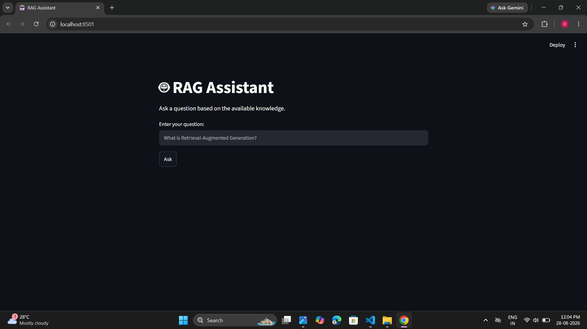
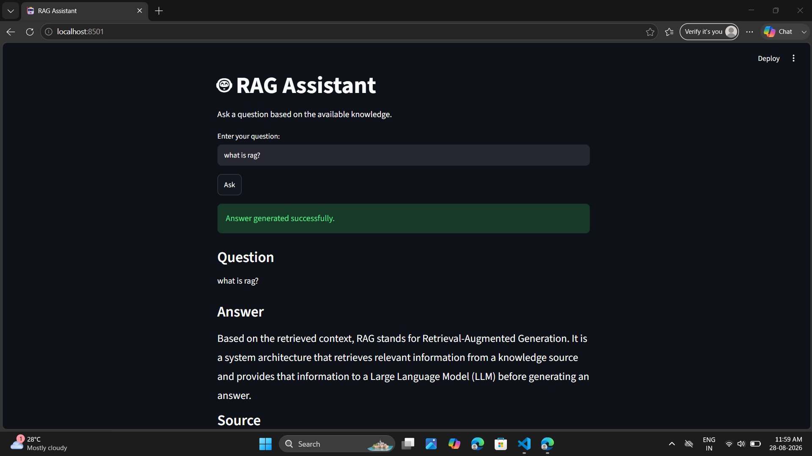
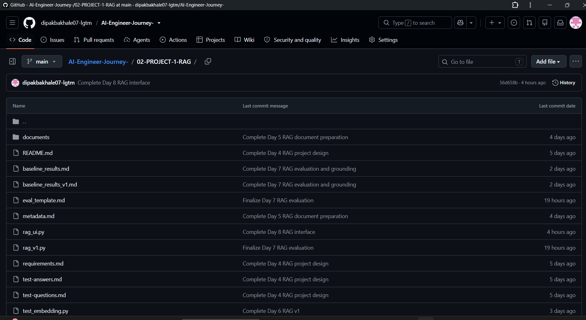

# 🤖 RAG Knowledge Assistant

A document-based AI assistant that answers questions using information
retrieved from approved knowledge documents.

This project was built as part of my **30-Day AI Builder Journey**.

The main goal is to understand and implement a complete
**Retrieval-Augmented Generation (RAG)** pipeline and make it usable
through a simple interface.

---

## 🎯 Problem

Large Language Models can have general knowledge that is not contained
in a specific collection of documents.

For a document-based assistant, the answer should be based on the
provided knowledge rather than the model's general knowledge.

This project uses **Retrieval-Augmented Generation (RAG)** to retrieve
relevant information from the supplied documents before sending that
information to the LLM.

If the required information is not present in the provided documents,
the assistant should not guess.

The fallback rule is:

> I could not find this information in the provided documents.

---

## 👤 Intended User

The intended user is someone who wants to ask questions about a
specific collection of approved knowledge documents.

The user does not need to understand embeddings, vector stores,
similarity search, or LLMs.

The user simply enters a question and receives an answer based on the
retrieved document information.

---

## ✨ Features

- Document-based question answering
- Document text processing
- Text chunking
- Embedding generation
- Vector storage
- Similarity-based retrieval
- Retrieval of relevant chunks
- LLM-based answer generation
- Grounded answer generation
- Source file display
- Streamlit user interface
- Empty-question handling
- Friendly error handling
- Testing with answerable questions
- Testing with questions outside the provided knowledge
- Independent usability testing

---

## 🧠 RAG Architecture

The project follows this architecture:

```text
                KNOWLEDGE DOCUMENT
                       │
                       ▼
              DOCUMENT PROCESSING
                       │
                       ▼
                    CHUNKING
                       │
                       ▼
                  EMBEDDINGS
                       │
                       ▼
                 VECTOR STORE
                       │
                       │
                       │
USER QUESTION ──► QUESTION EMBEDDING
                       │
                       ▼
                  RETRIEVAL
                       │
                       ▼
               RELEVANT CHUNKS
                       │
                       ▼
                    CONTEXT
                       │
                       ▼
                      LLM
                       │
                       ▼
                GROUNDED ANSWER
                       │
                       ▼
                    SOURCE

                    ---

## 🔄 How It Works

### 1. Document Loading

The system loads the approved knowledge documents.

### 2. Chunking

The documents are divided into smaller pieces called chunks.

### 3. Embeddings

Each chunk is converted into a numerical vector representation.

### 4. Vector Store

The chunk text and its embedding are stored for similarity search.

### 5. Question Embedding

When the user asks a question, the question is also converted into an embedding.

### 6. Retrieval

The question embedding is compared with stored embeddings to find the most relevant chunks.

### 7. Context Creation

The most relevant chunks are combined and provided to the LLM as context.

### 8. Answer Generation

The LLM generates an answer using only the retrieved context.

If the information is not available in the documents, the assistant responds:

> I could not find this information in the provided documents.

### 9. Source Display

The application displays the source document used by the RAG system.

---
## 🛠️ Technology Stack

This project uses the following technologies:

- **Python** — Main programming language
- **LangChain** — Document processing and AI components
- **Ollama** — Running AI models locally
- **llama3** — Language model for answer generation
- **nomic-embed-text** — Embedding model
- **Streamlit** — Web user interface
- **RecursiveCharacterTextSplitter** — Document chunking

---
## 📁 Project Structure

```text
02-PROJECT-1-RAG/
│
├── documents/
│   ├── ai-fundamentals.md
│   ├── llm-generative-ai.md
│   └── rag-fundamentals.md
│
├── screenshots/
│   ├── github-project.png
│   ├── rag-answer.png
│   └── rag-interface.png
│
├── rag_v1.py
├── rag_ui.py
├── requirements.txt
├── README.md
├── test-questions.md
├── test-answers.md
├── baseline_results.md
└── baseline_results_v1.md

## ⚙️ Setup and Installation

### 1. Clone the Repository

```bash
git clone YOUR_GITHUB_REPOSITORY_URL
cd 02-PROJECT-1-RAG

## 💬 How to Use

1. Start Ollama on your computer.

2. Run the Streamlit application:

```bash
py -m streamlit run rag_ui.py

## 🧪 Testing

The RAG Knowledge Assistant was tested with different types of questions.

### 1. Document-Based Questions

Questions whose answers were available in the provided knowledge documents were tested to verify that the system could retrieve relevant information and generate grounded answers.

### 2. Unsupported Questions

Questions whose answers were not available in the provided documents were tested to verify that the assistant does not use outside knowledge.

The expected fallback response is:

> I could not find this information in the provided documents.

### 3. Empty Questions

The Streamlit interface checks whether a question has been entered and displays a warning when the input is empty.

### 4. Different Question Wording

Different phrasings of similar questions were tested to check whether semantic embeddings could retrieve relevant chunks.

### 5. Evaluation Dataset

The project includes:

- `test-questions.md`
- `test-answers.md`
- `baseline_results.md`
- `baseline_results_v1.md`

The baseline evaluation contains 25 test questions covering both supported and unsupported information.

---

## 📊 Evaluation Results

The baseline RAG system was evaluated using:

- 3 knowledge documents
- 32 document chunks
- 25 test questions

The evaluation included:

- Questions answerable from the provided documents
- Questions outside the knowledge base
- Questions related to a topic but not explicitly supported by the documents

### Results Summary

The assistant generally answered document-supported questions using retrieved context.

For unsupported questions, the assistant used the fallback response:

> I could not find this information in the provided documents.

The evaluation identified areas where answer quality can be improved. Some answers were less detailed than expected even when relevant information was retrieved.

A formal PASS/FAIL percentage was not calculated for this baseline evaluation.

The detailed evaluation results are available in:

```text
baseline_results.md
baseline_results_v1.md

## 🔧 How I Would Improve RAG v2

Based on the baseline evaluation, I would improve the next version by:

### 1. Improve Answer Quality

Some answers can be too short or incomplete even when relevant information is retrieved.

I would improve the prompting and answer-generation logic to produce clearer and more complete answers while remaining grounded in the retrieved context.

### 2. Add Retrieval Confidence Thresholds

The system currently retrieves the most similar chunks.

A confidence threshold could help identify when the retrieved information is not sufficiently relevant and return the fallback response instead.

### 3. Add Better Source Citations

Future versions could display more detailed source information, such as:

- Source document name
- Retrieved chunk
- Similarity score
- Section information when available

---

## 💻 Cost and Performance

This project uses local Ollama models for embeddings and answer generation.

### Cost

- Cloud API cost per query: ₹0
- No paid API key is required.
- Local computation depends on the user's computer hardware and electricity usage.

### Performance

Response time can depend on:

- Computer hardware
- Ollama model size
- Number and size of document chunks
- Number of retrieved chunks

No formal average latency benchmark has been recorded yet.

---

## 🖼️ Screenshots

### RAG Assistant Interface



### Generated Answer



### GitHub Project



---

## ⚠️ Limitations

The current version of the project has some limitations:

- It currently uses local knowledge documents prepared for the project.
- The vector store is implemented as a simple in-memory structure.
- Documents must be prepared manually.
- Retrieval quality depends on document chunking and embeddings.
- The application does not yet support PDF upload through the interface.
- No formal latency benchmark has been recorded.
- Some answers may be shorter or less detailed than expected.

---

## 🔐 Security

This project does not require API keys for the current local Ollama setup.

Important security practices:

- Do not commit passwords.
- Do not commit private API keys.
- Do not commit `.env` files containing secrets.
- Use `.gitignore` to exclude sensitive or generated files.

Example `.gitignore` entries:

```text
__pycache__/
*.pyc
.env
.venv/
venv/